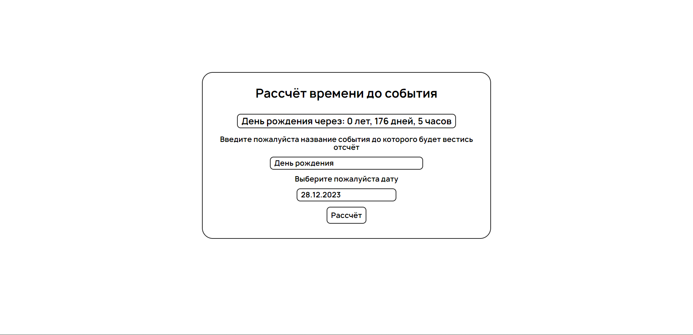

 

  

  <h3 align="center">Обратный отсчёт</h3>

  

    Программа для отсчёта времени до выбранной даты.
  

   

## Оглавление

- [О проекте](#about-the-project)
- [Построен с](#built-with)
- [Начиная](#getting-started)
  - [Всё необходимое](#prerequisites)
  - [Установка](#installation)
- [Использование программы](#usage)
- [Создание запроса на слияние](#contributing)
- [Лицензия](#license)
- [Автор](#authors)
- [Благодарности](#acknowledgements)

## О проекте

В этом проекте я реализовал отсчёт времени до выбранной пользователем даты.

## Построен с

Мой проект был сделан с помощью:
Сборщика проектов Parcel - https://ru.parceljs.org/,
eslint - https://www.npmjs.com/package/eslint,
плагин moment - https://momentjs.com/,
плагин air-datepicker - https://air-datepicker.com/ru

## Начиная

Чтобы локально запустить программу необходимо установить всё из package.json и запустить командой приведённой ниже.

### Всё необходимое

Список того, что вам будет необходимо сделать, чтобы получить всё необходимое для начала работы с проектом:

1. Клон моего репозитория в котором есть package.json

### Установка

1. Клонируйте себе мой репозиторий с программой

2. Установите содержимое package.json:
   npm install

3. Запуск проекта осуществляется командой:
   npm run pr

После этого у вас в браузере откроется программа.

## Использование программы

В первом поле даёте название события, а нажимая на 2 поле в календаре выберите желаемую дату, после этого нажмите кнопку рассчитать, чтобы получить результат в виде количества времени которое должно пройти чтобы наступила выбранная вами дата.

## Содействие

Вклады — это то, что делает сообщество открытого исходного кода таким замечательным местом, где можно учиться, вдохновляться и творить. Я очень ценю любой ваш вклад.

1. Если у вас есть предложения по добавлению или удалению проектов, не стесняйтесь открывать вопрос, чтобы обсудить его, или напрямую создать запрос на включение после того, как вы отредактируете файл README.md с необходимыми изменениями.
2. Пожалуйста, проверьте орфографию и грамматику. Создайте индивидуальный PR для каждого предложения.
3. Пожалуйста, также соблюдайте правила поведения, прежде чем опубликовать свою первую идею.

### Создание запроса на слияние

1. Разветвить проект
2. Создайте свою ветку (git checkout -b)
3. Зафиксируйте свои изменения (git commit -m "")
4. Push to the Branch (git push origin)
5. Откройте запрос на слияние

## Лицензия

Распространяется по лицензии MIT. См. [ЛИЦЕНЗИЯ](https://github.com/Kustiche/Countdown/blob/main/LICENSE) для получения дополнительной информации.

## Автор

- **Акимов Александр** - _Frontend-разработчик_ - [Акимов Александр](https://github.com/Kustiche) - _Мой Git_

## Благодарности

- [Анна](https://github.com/enotstitch)
- [Константин](https://github.com/ZayRexan)
